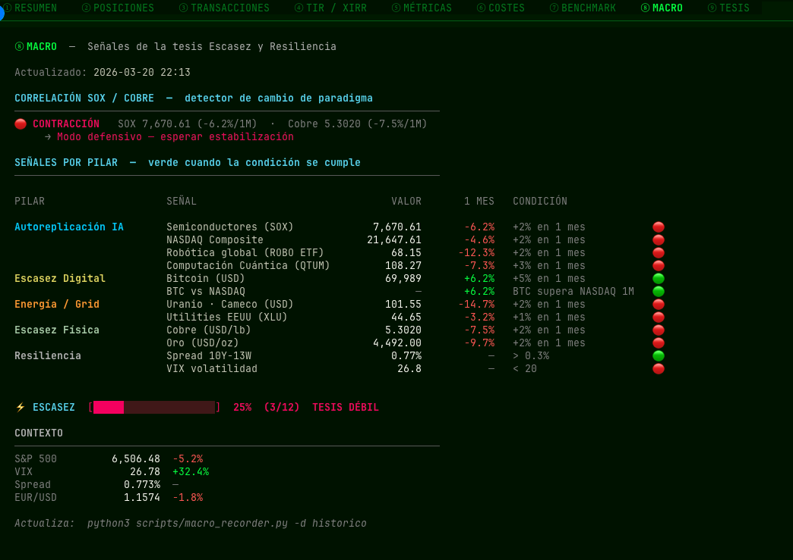

# 📊 Portfolio Terminal

Dashboard interactivo de inversiones para terminal, construido con [Textual](https://textual.textualize.io/).

Gestiona ETFs, fondos indexados y criptomonedas con histórico de precios en CSV, métricas avanzadas y un panel de indicadores macroeconómicos en tiempo real.

---

## 📸 Capturas de pantalla


*Pestaña ⑨ MACRO —  Indicadores macroeconómicos con contexto interpretativo para inversor a largo plazo.*

---

## ✨ Características

- **9 pestañas interactivas**: ① Resumen · ② Posiciones · ③ Transacciones · ④ TIR/XIRR · ⑤ Métricas · ⑥ Costes · ⑦ Benchmark · ⑧ Macro · ⑨ Tesis
- **Grabado automático de precios** desde Yahoo Finance, EODHD, Stooq y Morningstar
- **Métricas financieras**: Sharpe, Sortino, Beta, VaR 95%, drawdown, volatilidad, correlación
- **TIR anualizada (XIRR)** ponderada por flujos de caja reales — solo se muestra si la posición tiene ≥ 60 días (evita tasas anualizadas sin sentido estadístico)
- **Modelo logístico de tesis** (⑨ TESIS): `V(t) = Capital × (1+r)^t × Φ_L(t)/Φ_L(0)` con 3 escenarios — Base, Acelerado, Óptimo
- **Indicador ⚡ ESCASEZ** en el header: score 0–100% desde 12 señales macro alineadas a la tesis
- **Correlación SOX/Cobre**: detector de cambio de paradigma (ERA DE CONSTRUCCIÓN / DIVERGENCIA / CONTRACCIÓN)
- **Análisis de costes TER** con proyección a 5 y 10 años
- **Benchmark** vs cualquier fondo indexado global de tu cartera
- **Panel macro** con 17 indicadores: VIX, curva de tipos, USD, oro, petróleo, cobre, uranio, gas, semiconductores, utilities y Bitcoin
- **Modo privado** (`P`) para ocultar cifras en pantalla
- **Sin servidor** — todo corre en local, tus datos no salen de tu ordenador

---

## 🚀 Instalación

### Requisitos

- Python 3.9 o superior

### 1. Clona el repositorio

```bash
git clone https://github.com/TU_USUARIO/portfolio-terminal.git
cd portfolio-terminal
```

### 2. Instala las dependencias

```bash
pip install textual yfinance pyyaml requests rich
```

Opcionalmente, para exportar a Excel:

```bash
pip install openpyxl
```

### 3. Crea tu fichero de cartera

```bash
cp portfolio.example.yaml portfolio.yaml
```

Edita `portfolio.yaml` con tus activos y transacciones. El fichero de ejemplo incluye comentarios detallados en cada campo.

### 4. Crea las carpetas necesarias

```bash
mkdir -p historico exports
```

### 5. Lanza el dashboard

```bash
./terminal.sh
```

O directamente:

```bash
python3 scripts/portfolio_dash.py -f portfolio.yaml -d historico
```

---

## 📁 Estructura del proyecto

```
portfolio-terminal/
├── portfolio.example.yaml   ← Plantilla de cartera (copia a portfolio.yaml)
├── portfolio.yaml           ← Tu cartera personal (ignorada por .gitignore)
├── terminal.sh              ← Lanzador: graba precios + macro + abre dashboard
├── historico/               ← CSVs de precios diarios (ignorados por .gitignore)
├── exports/                 ← Informes Excel generados (ignorados por .gitignore)
└── scripts/
    ├── portfolio_dash.py         ← Dashboard interactivo (Textual)
    ├── price_recorder.py         ← Grabador de precios al cierre de mercado
    ├── macro_recorder.py         ← Grabador de indicadores macroeconómicos
    ├── fx_convert_historical.py  ← Conversión USD→EUR en CSVs existentes
    └── export_historico.py       ← Exportador a Excel + Markdown
```

---

## ⌨️ Controles del dashboard

| Tecla | Acción |
|-------|--------|
| `1`–`9` | Cambiar entre pestañas |
| `R` | Recargar datos |
| `P` | Modo privado (oculta cifras) |
| `A` | Añadir transacción |
| `E` | Editar transacción (buscador con filtro en tiempo real) |
| `D` | Borrar transacción (buscador + confirmación) |
| `T` | Cambiar rango del gráfico histórico |
| `F` | Filtrar posiciones por taxonomía |
| `Q` | Salir |

---

## 📋 Configurar tus activos

Edita `portfolio.yaml` con tus activos. Ejemplo mínimo:

```yaml
meta:
  nombre: "Mi Portafolio"
  divisa_base: EUR

activos:
  - ticker: IE00B03HCZ61
    nombre: "Vanguard Global Stock Index EUR Acc"
    tipo: Fondo
    taxonomia: Renta Variable
    divisa: EUR
    ter: 0.0012
    transacciones:
      - fecha: "2024-01-15"
        tipo: compra
        participaciones: 10.000000
        precio: 42.50
        comision: 0.00
        nota: "Primera aportación"
```

### Tipos de activo soportados

| `tipo` | Descripción |
|--------|-------------|
| `ETF` | ETF cotizado en bolsa |
| `Fondo` | Fondo de inversión no cotizado |
| `Crypto` | Criptomoneda |

### Taxonomías incluidas por defecto

`Renta Variable` · `Metal Precioso` · `Metal` · `Tecnología / AI` · `Energía / Nuclear` · `Computación Cuántica` · `Bitcoin`

Puedes usar cualquier texto como taxonomía — el filtro de posiciones (`F`) las agrupa automáticamente.

---

## 📈 Grabar precios

```bash
# Grabar precio de cierre de hoy
python3 scripts/price_recorder.py -f portfolio.yaml -d historico --show

# Actualizar indicadores macroeconómicos
python3 scripts/macro_recorder.py -d historico --show

# Todo a la vez (lo hace terminal.sh automáticamente)
./terminal.sh
```

---

## 🔧 Opciones avanzadas de activos

### Activos en divisa extranjera (USD, GBP…)

Los precios se almacenan siempre en EUR. El grabador descarga el tipo de cambio diario y convierte automáticamente. El precio original queda en la columna `notas` del CSV.

```yaml
  - ticker: IVV
    nombre: "iShares Core S&P 500 ETF"
    divisa: USD   # el grabador convierte a EUR usando USDEUR diario
```

### Múltiples activos compartiendo el mismo histórico

Útil para varias wallets de Bitcoin o cuentas del mismo activo:

```yaml
  - ticker: BTC-WALLET-1
    yahoo_ticker: BTC-EUR
    historico_ticker: BTC-EUR   # comparte CSV con BTC-WALLET-2

  - ticker: BTC-WALLET-2
    yahoo_ticker: BTC-EUR
    historico_ticker: BTC-EUR
```

### Fondos no disponibles en Yahoo Finance

Usa el campo `isin` para que el grabador los busque vía Morningstar (fondos IE, LU, ES):

```yaml
  - ticker: LU0996182563
    isin: LU0996182563
    nombre: "Amundi IS MSCI World AE-C"
    tipo: Fondo
    divisa: EUR
```

### API key EODHD (opcional)

Para ETFs europeos con cobertura limitada en Yahoo, obtén una clave gratuita en [eodhd.com](https://eodhd.com) (20 peticiones/día gratuitas) y añádela a `portfolio.yaml`:

```yaml
configuracion:
  eodhd_api_key: "TU_API_KEY"
```

---

## 📊 Exportar a Excel

```bash
python3 scripts/export_historico.py -f portfolio.yaml -d historico -o exports
```

Genera un fichero `.xlsx` con histórico completo, resumen de posiciones y métricas.

---

## 📐 Formulación matemática de las métricas

### Retornos diarios
$$r_t = \frac{P_t - P_{t-1}}{P_{t-1}}$$

### XIRR — Tasa Interna de Retorno anualizada
Tasa `r` que hace cero el valor presente neto de todos los flujos de caja (solo representativa con ≥ 60 días desde la primera compra):
$$\sum_{i=0}^{n} \frac{C_i}{(1+r)^{t_i}} = 0$$
`Cᵢ` negativo = compra · positivo = venta o valor actual hoy. Se resuelve con Newton-Raphson.

### Precio medio de compra
$$P_{medio} = \frac{\sum(n_i \times p_i + c_i)}{\sum n_i}$$

$n_i$ = participaciones · $p_i$ = precio · $c_i$ = comisión de cada compra $i$

### Ganancia / Pérdida
$$G = V_{actual} + I_{ventas} - I_{total}$$

$V_{actual}$ = valor de mercado hoy · $I_{ventas}$ = ingresos por ventas · $I_{total}$ = total invertido

### Volatilidad anualizada
$$\sigma_{anual} = \sigma_{diaria} \times \sqrt{252}$$

### Sharpe Ratio — rentabilidad por unidad de riesgo total
$$\text{Sharpe} = \frac{\bar{r} - r_f}{\sigma_{diaria}} \times \sqrt{252}$$
`rᶠ` = tasa libre de riesgo diaria (3% / 252). Sharpe > 1 = rentabilidad compensa el riesgo.

### Sortino Ratio — solo penaliza volatilidad a la baja
$$\text{Sortino} = \frac{\bar{r} - r_f}{\sigma_{\downarrow}} \times \sqrt{252}, \quad \sigma_{\downarrow} = \sqrt{\frac{\sum_{r_t < r_f}(r_t - r_f)^2}{n}}$$
Más justo que Sharpe para activos asimétricos (Bitcoin, materias primas).

### VaR histórico al 95%
$$VaR_{95} = -\; r_{(5)}$$

Ordena todos los retornos de menor a mayor y toma el 5% peor. Pérdida máxima esperada en el 5% de peores días históricos.

### Max Drawdown
$$\text{MaxDD} = \max_{t}\frac{\text{pico}_t - P_t}{\text{pico}_t}$$

### Drawdown Actual
$$DD_{actual} = \frac{\max(P) - P_{hoy}}{\max(P)}$$

### Beta vs benchmark
$$\beta = \frac{\text{Cov}(r_A,\, r_B)}{\text{Var}(r_B)}$$
β > 1 = amplifica movimientos del mercado · β < 1 = defensivo · β < 0 = inversamente correlado.

### Correlación de Pearson
$$\rho_{AB} = \frac{\sum(r_{At}-\bar{r}_A)(r_{Bt}-\bar{r}_B)}{\sqrt{\sum(r_{At}-\bar{r}_A)^2} \cdot \sqrt{\sum(r_{Bt}-\bar{r}_B)^2}}$$

Rango −1 a +1. Valores cercanos a 0 indican buena diversificación entre activos.

### TER — Coste anual de gestión
$$C_{anual} = V_{actual} \times TER$$
El TER se descuenta diariamente del valor liquidativo del fondo.

---

## 📄 Paper académico

El modelo de tesis implementado en la pestaña ⑨ está documentado en:

> Vilar, J. A. (2026). *Scarcity and Resilience: A Mathematical Framework for Investing in the Age of Artificial Self-Replication*. SSRN Working Paper.

El modelo logístico `V(t) = Capital × (1+r)^t × Φ_L(t)/Φ_L(0)` — donde `Φ_L(t) = 1 + K / (1 + e^(−γ·(t−t₀)))` — captura la aceleración no lineal de la IA con parámetros calibrables de forma independiente: `K` (techo de replicación), `γ` (velocidad de adopción) y `t₀` (año de inflexión).

---

## 🤝 Contribuir

Las contribuciones son bienvenidas. Por favor:

1. Haz fork del repositorio
2. Crea una rama para tu mejora (`git checkout -b feature/mi-mejora`)
3. Abre un Pull Request describiendo los cambios

Ideas de mejora: soporte para nuevas fuentes de precio, nuevas métricas, internacionalización, tema de colores configurable.

---

## 📄 Licencia

MIT — úsalo, modifícalo y distribúyelo libremente.

---

## 👤 Autor

**Jose Antonio Vilar** — [github.com/josevilar-qbioai/](https://github.com/josevilar-qbioai/)

---

## ⚠️ Aviso legal

Este software es una herramienta de seguimiento personal. No constituye asesoramiento financiero. Las métricas son informativas y se basan en datos históricos. Las rentabilidades pasadas no garantizan resultados futuros.
